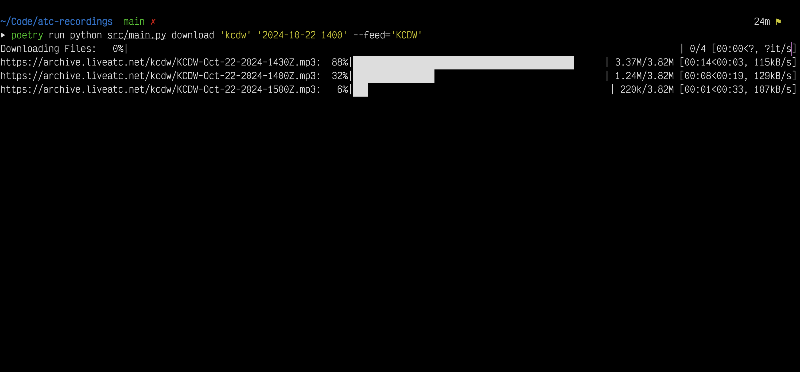

# ATC Recording Tool

## Description

One of the more difficult skills for pilots to master is radio communication. Fortunately, it is easy to listen to live and archived feeds of ATC communications at https://liveatc.net.

The archived feeds are broken into 30-minute chunks, and it is only possible to download one at a time from their website. Many of the feeds that could be useful for less experienced pilots are at airports that don't have constant activity, so bypassing silence to find conversations can be difficult.

This CLI tool allows the user to download multiple archive files at once, combine them into a single file, and strips out the silence so you can get a lot of quality content with little effort.

## Table of Contents (Optional)

- [Installation](#installation)
- [Usage](#usage)
- [Credits](#credits)
- [License](#license)

## Installation

This script was written in Python using [Poetry](https://python-poetry.org/) as a package and dependency manager. To use this script you'll need to install:

- [Python 3.8](https://www.python.org/downloads/release/python-380/)
- [Poetry](https://python-poetry.org/docs/#installation)
- [ffmpeg](https://formulae.brew.sh/formula/ffmpeg)

After installing these tools you should simply be able to run:

```
poetry install
```


## Usage



There are two main commands: `download` and `cleanup`

### Download

For a list of arguments, type:

`poetry run python3 src/main.py download --help`

The download command takes two arguments and two options. The arguments are used to generated the name of the file(s) to download from LiveATC.net. An example URL is:

https://archive.liveatc.net/kcdw/KCDW-Oct-24-2024-0000Z.mp3

- The `airport` argument corresponds to the 4-character ICAO airport code, and makes up the `path` component of the filename. For the above example, the airport would be `kcdw`
- The `start` argument is the UTC date time (`YYYY-mm-dd H:I`) of the first archive file to download. Above, it would be `2024-10-24 00:00`.
- The `feed` option is the part of the filename that precedes the datetime. By default, this is set equal to the uppercase version of the `airport` argument. However, some airports have multiple feeds, and this component will change (eg `KFJK-Gnd`)
- The `number-of-periods` option specifies how many feeds to download. The default is 4 (ie. feeds between 00:00Z and 02:00Z would be downloaded in the above example)

The full command to download all of the feed recordings between 00:00Z and 03:00Z above would be:

```bash
poetry run python3 src/main.py download 'kcdw' '2024-10-24 00:00' --feed='KCDW' --number-of-periods=6
```

After downloading all of the files, they will be combined, silence will be stripped, and they will output in a directory with the following naming:

`[Feed name]-[Month]-[Date]-[StartTime]-[EndTime]-combined/`

### Cleanup

This script creates a `/tmp` directory while downloading files, as well as the output directory/files when it is done. If you want to remove all artifacts that this script has generated you can simply run:

```bash
poetry run python3 src/main.py cleanup
```

## License
The MIT License (MIT)

Copyright (c) 2015 Chris Kibble

Permission is hereby granted, free of charge, to any person obtaining a copy of this software and associated documentation files (the "Software"), to deal in the Software without restriction, including without limitation the rights to use, copy, modify, merge, publish, distribute, sublicense, and/or sell copies of the Software, and to permit persons to whom the Software is furnished to do so, subject to the following conditions:

The above copyright notice and this permission notice shall be included in all copies or substantial portions of the Software.

THE SOFTWARE IS PROVIDED "AS IS", WITHOUT WARRANTY OF ANY KIND, EXPRESS OR IMPLIED, INCLUDING BUT NOT LIMITED TO THE WARRANTIES OF MERCHANTABILITY, FITNESS FOR A PARTICULAR PURPOSE AND NONINFRINGEMENT. IN NO EVENT SHALL THE AUTHORS OR COPYRIGHT HOLDERS BE LIABLE FOR ANY CLAIM, DAMAGES OR OTHER LIABILITY, WHETHER IN AN ACTION OF CONTRACT, TORT OR OTHERWISE, ARISING FROM, OUT OF OR IN CONNECTION WITH THE SOFTWARE OR THE USE OR OTHER DEALINGS IN THE SOFTWARE.

## Tests

```bash
poetry run pytest
```
